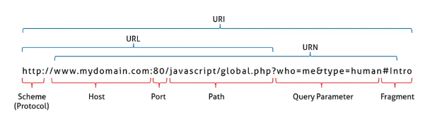
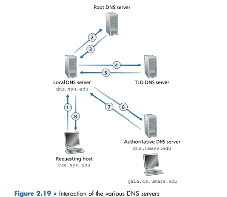
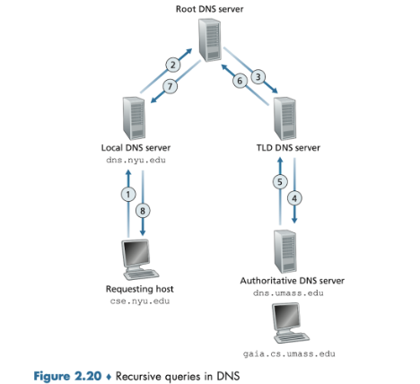

## 1. 프로토콜 - HTTP

**HTTP**

- **H**yper**T**ext **T**ransfer **P**rotocol (하이퍼텍스트 전송 규약)
- 웹에서 클라이언트와 서버처럼 서로 다른 시스템이나 기기간의 통신(데이터교환)을 위한 규약
- 헤더와 페이로드로 이루어져 있음
  - 헤더(Header) : HTTP 요청이나 응답에 대한 메타 데이터
  - 페이로드(Payload) : 실제 데이터

**HTTPS**

- HTTP에 SSL 프로토콜을 추가해 데이터를 암호화 하는 프로토콜
- **데이터 전송 전에 패킷을 암호화 →** 제3자가 가로챌 수 없도록 보안 강화(**S**ecure)

**HTTP/HTTPS 특징**

- 비연결성(**`Connectionless`**) : client가 server에 요청을 보내고 서버가 응답하면 TCP/IP 연결 끊음 ⇒ 접속을 종료한다.
- 무상태성(**`Stateless`**) : 통신이 끝나면 server가 client의 이전 상태를 유지하지 않는다.
- **비교**
  | | HTTP | HTTPS |
  | ----------------------- | --------------------------- | ---------------------------------- |
  | 의미 | Hypertext Transfer Protocol | Hypertext Transfer Protocol Secure |
  | 기본 프로토콜 | HTTP/1 및 HTTP/2: TCP/IP | HTTP/3: QUIC 프로토콜 | HTTP/2 + SSL/TLS |
  | 포트 | 기본 포트 80 | 기본 포트 443 |
  | 보안 | x | 퍼블릭 키 암호화에 SSL 인증서 사용 |
  | 이점 | 인터넷을 통한 통신 지원 | 신뢰성, SEO 개선 |

**SSL/TLS 인증서란?**

- SSL/TLS 프로토콜을 사용해 **암호화된 네트워크 연결을 설정할 수 있게** 함. 즉 연결이 설정된 client-server만 전송한 데이터를 볼 수 있음
- **네트워크 암호화 설정 과정**

  - 유저가 SSL/TLS 보안 웹 사이트(=https)에 접속
  - 브라우저가 서버의 진위 여부 확인을 위해 식별 가능한 정보를 요청
  - 서버가 암호화에 필요한 `퍼블릭 키`를 SSL/TLS 인증서에 담아 회신
  - 브라우저는 SSL/TLS 인증서가 유효한지 확인 (ex. 도메인 일치 여부, 만료 여부 등)
  - 유효하면 `퍼블릭 키`를 사용해 `비밀 세션 키`를 포함해 데이터를 암호화하여 전송
  - 서버는 브라우저가 보낸 데이터를 `프라이빗 키`로 복호화하고 세션 키를 꺼냄
  - 서버는 `세션 키`를 사용해 암호화하고 브라우저에 승인 메시지를 보냄
  - 브라우저-서버가 동일한 `세션 키`를 사용하여 안전하게 통신
    <aside>
    💡 퍼블릭 키로 암호화한 파일은 프라이빗 키로만 복호화할 수 있고, 그 반대의 경우도 마찬가지이다. 해당 파일을 복호화할 수 있다는 것은, 수신자/발신자를 신뢰할 수 있음을 나타낸다.

    </aside>

    <aside>
    💡 세션 키는 초기 SSL/TLS 인증이 완료된 후, 브라우저와 서버 간 암호화된 통신을 유지한다. 세션 키는 암호화와 복호화에 동일한 키를 사용하는 대칭 암호화를 위한 키이다.
    비대칭 암호화(ex. 퍼블릭 키 암호화-프라이빗 키 복호화)는 계산 비용이 엄청나기 때문에, 인증이 완료된 이후부터는 계산이 덜 필요한 대칭 암호화로 전환하는 것이다.

    </aside>

[**HTTP 버전별 특징**](https://zu-techlog.tistory.com/113)

| **버전** | **특징**                                               |
| -------- | ------------------------------------------------------ |
| HTTP 1.0 | - 최초 표준 버전으로, 가장 기초적인 전송 형식이 확립됨 |

- 하나의 연결당 하나의 요청만 처리 가능
- 연결이 요청 완료 후 즉시 닫힘 (비효율성) |
  | HTTP/1.1 | - Keep-Alive 옵션 도입: 하나의 연결에서 여러 요청/응답 가능
- Chunked Transfer Encoding 지원: 대용량 데이터를 나눠서 전송 가능
- 연결 지속성이 향상됨 |
  | HTTP/2 | - 전송 데이터 형식변경 : 텍스트 → 바이너리
- 다중화 프로토콜 도입: 동일한 연결에서 병렬 요청 수행 가능
- 헤더 압축: 요청/응답 헤더를 압축하여 오버헤드를 줄임
- 서버 푸시: 서버가 클라이언트의 요청 없이도 리소스를 미리 전송 가능 |
  | HTTP/3 | - 전송 계층 변경: TCP/IP → QUIC(UDP기반)
- 업그레이드된 다중화 프로토콜: QUIC은 UDP를 통해 여러 스트림을 독립적으로 실행 ⇒ 오류 발생 시 해당 스트림만 차단 (HTTP/2의 다중화 프로토콜은 모든 스트림이 차단됨) |

**HTTP Status Code**

클라이언트가 보낸 특정 HTTP 요청에 대한 서버의 응답 코드 상태 코드에 따라 요청의 성공이나 실패 여부 판단

| **상태코드** | **의미**        | **해석**                                            |
| ------------ | --------------- | --------------------------------------------------- |
| **1xx**      | 정보제공        | 클라이언트의 요청을 받았으며 프로세스를 계속 진행함 |
| **2xx**      | 성공            | 클라이언트의 요청이 성공적으로 처리됨               |
| **3xx**      | 리다이렉션      | 클라이언트는 요청 완료를 위해 추가 작업을 해야 함   |
| **4xx**      | 클라이언트 에러 | 클라이언트의 요청에 오류가 있음                     |
| **5xx**      | 서버 에러       | 서버가 요청을 처리하는 데 실패함                    |

 

## 2. RESTful API

**API(Application Programming Interface)**

응용 프로그램에서 데이터를 주고 받기 위한 인터페이스로 어떠한 사이트에서 데이터를 공유할 경우 어떤 방식으로 정보를 요청해야 되는지, 어떠한 형태로 데이터를 제공받게 되는지에 대한 규격

**REST(Representational State Transfer)**

자원을 기반으로 클라이언트와 서버의 상호작용을 정의하는 아키텍처

**REST의 구성요소**

- **자원(RESOURCE)**
  - REST 아키텍처에서 다루는 객체나 데이터
  - 고유한 식별자(HTTP URI)로 구별된다.
- **행위(Verb)**
  - 클라이언트가 자원에 대해 어떤 작업을 수행할 지 결정하는 HTTP 메서드
  - 종류
    | **메서드** | **설명** | **멱등성** | **특징** |
    | --------------------------------------------- | --------------------------------------- | ---------- | ----------------------------------------------------------------------------------------- |
    | **`GET`** | 자원 조회 | O | - 요청 본문 없음. | - 쿼리 문자열을 통해 데이터를 전달할 수 있음. |
    | **`POST`** | 새로운 자원 생성 | X | - 요청 본문에 데이터를 포함하여 전달 |
    | **`PUT`** | 자원 업데이트(전체 수정) | O | - 요청 본문에 업데이트할 데이터를 포함하여 전달 |
    | **`DELETE`** | 자원 삭제 | O | - 요청 본문에 삭제할 데이터를 포함할 수 있지만, 일반적으로는 쿼리 문자열에 데이터 전달 |
    | **`PATCH`** | 자원의 일부 수정(부분 수정) | X | - 요청 본문에 수정할 데이터를 포함하여 전달 |
    | **`HEAD`** | 자원에 접근할 수 있는지 확인 | O | - 자원에 대한 메타데이터를 가져올 때 사용 |
    | **`OPTIONS`** | 서버가 지원하는 메서즈를 확인할 때 사용 | O | - CORS 요청에서 주로 사용되며, 클라이언트와 서버간의 상호 작용 규칙을 미리 확인할 때 유용 |
    | **`TRACE`** | 서버로 보낸 요청을 다시 받아서 확인 | O | - 디버깅 용도로 사용 |
    | **`CONNECT`** | 목적지 서버로의 터널을 설정 | X | - 프록시를 통해 암호화된 연결을 설정할 때 사용 |
    | - 클라이언트와 서버간의 보안 연결 설정시 사용 |
- **표현(Representations)**
  - 클라언트와 서버간에 자원이 전달되는 방식
  - 자원자체는 서버에 저장되어 있지만 클라이언트는 자원에 직접접근하는 것이 아닌 자원의 표현으로 전달받는다.
  - HTTP Message Pay Load

**REST API(Representational State Transfer)**

- REST 아키텍쳐를 따르는 API

 

## 3. 프록시(Proxy)란?

**프록시/프록시서버**

- 서버와 클라이언트 사이에서 대리로 통신을 수행해 주는 것으로 중계 역할을 해주는 서버를 프록시 서버라고 한다.
- 종류
  
  **포워드 프록시**
  - 클라이언트 앞에 높여 사용자의 요청을 받아 서버에게 전달해주는 프록시
  - 서버는 어떤 사용자와 통신하는지 알 수 없고, 프록시와 통신하게 됨.
  - 캐싱된 데이터가 존재한다면 중간에서 빠르게 클라이언트에게 응답 해줌
    **리버스 프록시**
  - 서버의 앞에 놓여 사용자의 클라이언트의 요청을 받아 서버에게 전달해주는 프록시
  - 클라이언트는 어떤 서버와 통신하는지 알 수 없고, 프록시와 통신하게 됨.

**프록시 서버 사용 이유**

- **보안 강화**
  - 사용자 또는 실제 서버의 IP를 숨겨 공격을 피함
- **캐시 사용**
  - 프록시 서버에 자주 사용한 데이터를 저장해 속도를 향상
- **로드 밸런싱**
  - 본 서버 앞에 리버스 프록시를 두어 대량의 트래픽이 와도 부하되지 않게 함
- **로그 관리**
  - 프록시 서버에 사용자 요청 기록이 남음
  - 어떤 IP가 어떤 IP로 얼마나 접속했는지 확인
- **접속 우회**
  - 지역 IP가 차단된 경우, 프록시 서버를 사용해 다른 곳에서 접속한 것처럼 우회 가능

## 2. DNS

**IP 주소**

네트워크 상에서 인터넷에 연결된 컴퓨터들이 서로를 인식하기 위해 지정받은 식별용 번호

**도메인(Domain)**

IP 주소를 식별하는 문자열

**DNS(Domain Name System)**

- 도메인과 IP 주소로 변환하는 분산 계층시스템
  - **분산**: DNS 서버는 1개가 아니라 여러 개이며 세부적인 역할이 다름
  - **계층**: 여러 DNS는 계층 구조를 이룸 (Root→TLD→SLD)
- DNS는 프로토콜이며, DB 이 모든것을 포함하는 시스템이다.

**URI/URL/URN**

- `URI` : 인터넷 자원을 식별할 수 있는 문자열
- `URL` : 리소스를 어떻게 얻을것이고 어디에서 가져와야 하는지 명시하는 URI
- `URN` : 리소스 경로

[**주소창에 URL을 검색했을 때 일어나는 일?**](https://github.com/FEDeepDive/Front-end/blob/devkyoung2/9.%20WebBrowser.md)

1. 사용자가 브라우저에 URL(www.naver.com)을 입력한다.
2. 입력한 URL 주소 중, 도메인 이름에 해당하는 naver.com가 캐싱 되어있나 확인

   1-1. 도메인 이름에 맞는 IP 주소가 존재하면 바로 IP 주소를 반환

   1-2. 도메인 이름에 맞는 IP 주소가 존재하지 않는다면 DNS 서버에 IP 주소 요청

3. 브라우저가 서버와 TCP 연결을 진행
4. 전달받은 IP 주소를 이용해 웹 브라우저는 웹 서버에게 해당 웹 사이트에 맞는 HTML 문서 요청(HTTP 프로토콜 사용)

   2-1. 이때, 웹서버는 정적인 데이터를 클라이언트로 바로 돌려줄 수 있으나, 동적인 데이터는 was로 요청함

### DNS 구성

- **DNS Resolver**
  - 사용자와 DNS 네임서버 간 요청/응답 중개 서버
  - 쿼리 방식(아래 참조)에 따라 네임서버에 쿼리를 보내고, 획득한 IP 주소를 사용자에 응답함
  - 획득한 IP 주소를 캐시함
- **Root Name Server**
  - 모든 DNS 조회가 시작되는 DNS 최상단 계층 서버
  - 도메인을 해석해 TLD 서버 정보를 반환함
- **TLD(Top-Level Domain) Name Server**
  - 도메인 이름을 가지고 SLD 서버 정보를 반환함
- **SLD(Second-Level Domain) Name Server**
  - `도메인`과 `IP 주소`의 맵핑 관계를 저장하고 있는 서버
  - 도메인에 대한 IP 주소를 반환함
  - 하위 도메인 이름이 있으면(ex. `sub.example.com`) 추가적인 SLD 서버 정보를 반환함
  - 최종 결정 권한이 있어, **“Authoritative Server”** 라고도 불림

### 동작 방식

- **Iterative Query**: IP 주소를 얻을 때까지 Root, TLD, SLD 네임서버에 순차적으로 쿼리를 보냄
  
  1. 사용자가 주소창에 `example.com`을 입력 → 요청이 인터넷으로 이동해 DNS Resolver가 이를 수신
  2. **DNS Resolver**가 **Root Server**에 쿼리
  3. **Root Server**가 `com`을 관리하는 **TLD Server** 정보를 반환
  4. **DNS Resolver**가 `com` **TLD Server**에 쿼리
  5. **TLD Server**가 `example.com`을 관리하는 **SLD Server** 정보를 반환
  6. **DNS Resolver**가 `example.com` **SLD Server**에 쿼리
  7. **SLD Server**가 `example.com`의 IP 주소를 반환
  8. **DNS Resolver**가 해당 IP 주소를 브라우저에게 응답 (+ IP 주소 캐싱)
- **Recursive Query**: DNS 네임서버 간 재귀적으로 쿼리를 보냄
  
    <aside>
    💡 성능 측면에서는 Iterative Query보다 빠르지만, **보안에 취약** 하여 권장되지 않는다.
    가령 중간에 위치한 DNS 서버가 악성 코드나 위조된 DNS 서버 정보를 제공한다거나, 제3자가 사용자의 트래픽을 가로채고 조작할 수 있다.
    
    </aside>
